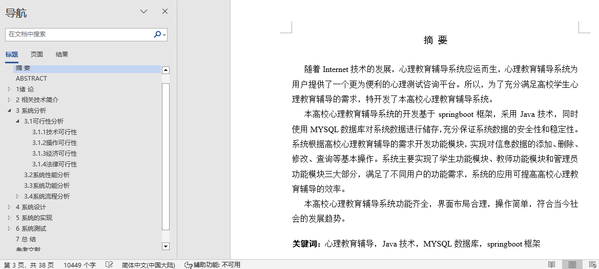
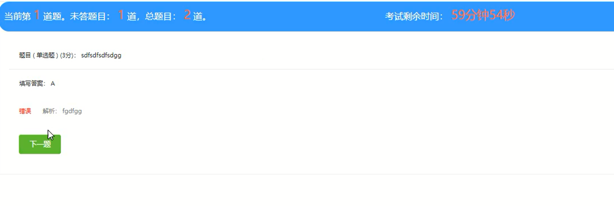
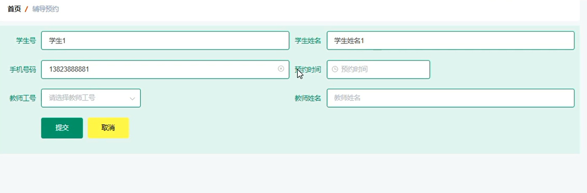
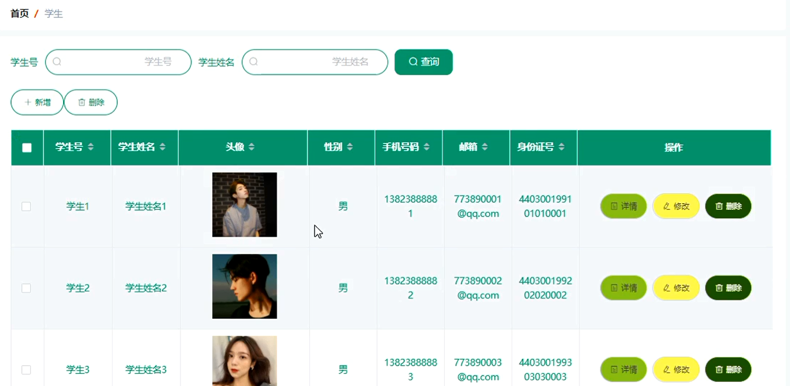
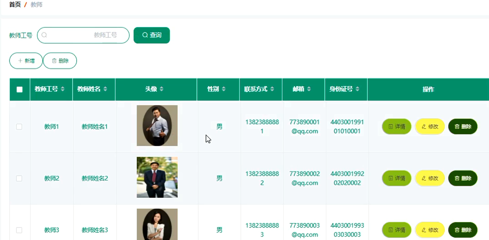
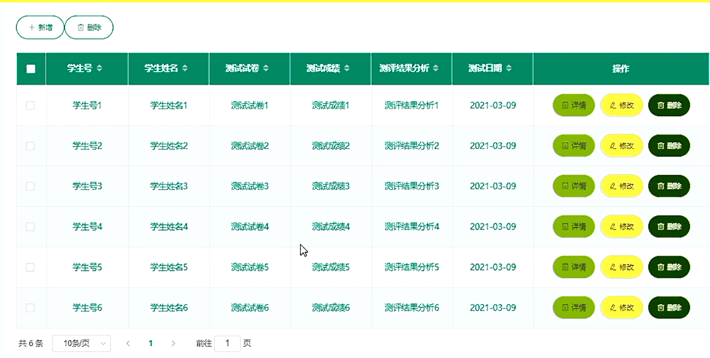
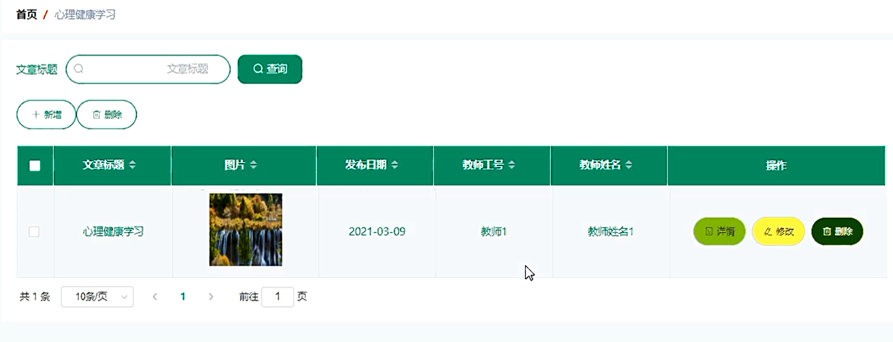
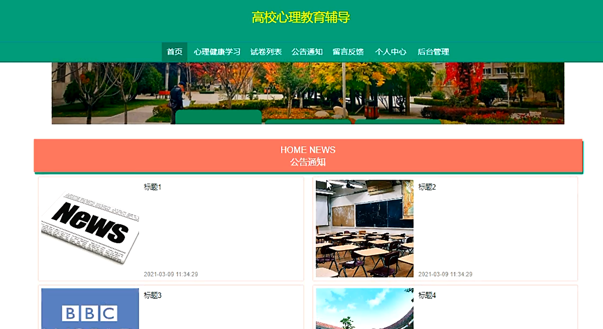

## 基于SpringBoot的高校心理教育辅导系统(程序+报告)

- <b>完整代码获取地址：从戎源码网 ([https://armycodes.com/](https://armycodes.com/))</b>
- <b>技术探讨、资料分享，请加QQ群：692619798</b> 
- <b>作者微信：19941326836  QQ：952045282</b> 
- <b>承接计算机毕业设计、Java毕业设计、Python毕业设计、深度学习、机器学习</b>
- <b>选题+开题报告+任务书+程序定制+安装调试+论文+答辩ppt 一条龙服务</b>
- <b>所有选题地址 ([https://github.com/YuLin-Coder/AllProjectCatalog](https://github.com/YuLin-Coder/AllProjectCatalog)) </b>

## 项目介绍
基于SpringBoot的高校心理教育辅导系统，系统包含两种角色：用户、管理员，系统分为前台和后台两大模块，主要功能如下：

### 【管理员】:
管理员登录界面  
管理员必须登录后台系统才能进行管理操作。

学生管理界面  
管理员可以查看所有学生信息，并对其进行修改和删除操作。

教师管理界面  
管理员可以增删改查教师信息。

辅导预约管理界面  
管理员可以查看学生的辅导预约信息，并对其进行审核。

### 【教师】:
个人信息界面  
教师登录后可以进入个人信息界面进行个人资料的修改。

测试结果分析管理界面  
教师可以对测试结果进行增删改查操作。

### 【学生】:
学生登录界面  
学生需输入正确的用户名和密码进行登录。系统会验证登录信息，如果信息正确则登录成功，否则登录失败。

留言反馈界面  
学生可以在留言反馈界面发布留言，提供反馈意见。

试卷列表界面  
学生可以查看所有试卷并选择进行考试。考试界面展示了试卷的详细内容和考试操作选项。

辅导预约界面  
学生登录后可以进行辅导预约操作。

## 项目技术
- 编程语言：Java
- 数据库：MySQL
- 项目管理工具：Maven
- 前端技术：HTML、CSS、JavaScript、Jquery、Vue
- 后端技术：Spring、SpringMVC、MyBatis

## 运行环境
- JDK版本：JDK1.8及以上
- 开发工具：IDEA、Ecplise、Myecplise都可以
- 数据库: MySQL5.7及以上
- Maven：maven3.0及以上
- Node：14.14.0及以上

## 运行截图

